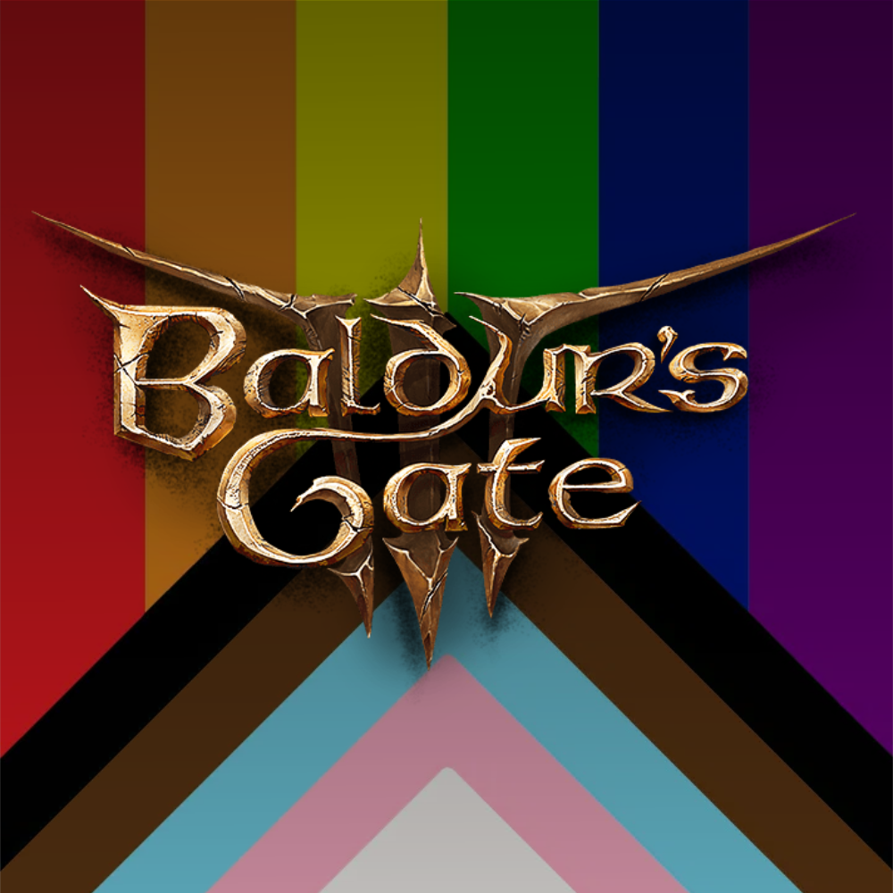

# BG3 Mod Manager resources

This repository contains resources relating to my custom mod manager (name pending).

This also includes a custom mod format, including a custom file used by the manager to
place files where they belong and provide information on the mod.

## Mod Format

The mod format is essentially a `.zip` archive with a fancy file for metadata relating
to the mod, as well as the mod files themselves.

### `bg3.index.json5`

This file contains a sample/WIP version of an index file for Baldur's Gate 3
mods, which is _highly_ based on Modrinth's [`.mrpack` format](https://docs.modrinth.com/modpacks/format).

## Art

While very loosely considered art, here's the current GitHub avatar for Baldur's Gay.

## License

Original content in this repository is licensed under [CC0 1.0 Universal](/LICENSE),
while the Baldur's Gate 3 logo is licensed as All Rights Reserved by Larian Studios.
